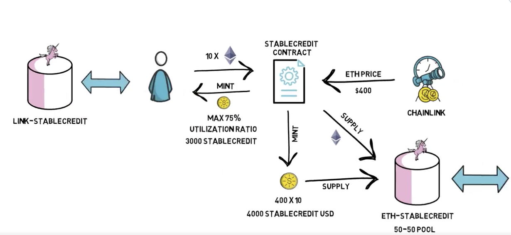

# StableCredit

The diagram is from [@finematics tweet](https://twitter.com/finematics/status/1305188626008100865)

- [Introducing StableCredit, a new protocol for decentralized lending, stablecoins, and AMMs.](https://medium.com/iearn/introducing-stablecredit-a-new-protocol-for-decentralized-lending-stablecoins-and-amms-7252a43ee56)

- [Tweet storm via @DeFiGod](https://twitter.com/DeFiGod1/status/1304070343204712452)
- [Codeup Video](https://youtu.be/bdC3rNDChbw?t=1998)
- [Bankless video](https://www.youtube.com/watch?v=SkTuMVBLBNQ)

## Source

- [StableCreditProtocol](https://etherscan.io/address/0x15fe17da18288d1799643be1bb07fb939626f5f9#code)
- [StableCreditHelper](https://etherscan.io/address/0xe0ca06c6972d8c71b70475faa9d7b3f3a505ec69#code)

## UML

- [StableCreditProtocol.sol.svg](StableCreditProtocol.sol.svg)
- [StableCreditProtocolHelper.sol.svg](StableCreditProtocolHelper.sol.svg)

## Flows

### Deposit

- [stablecredit-deposit.pdf](./stablecredit-deposit.pdf)

### Deposit all

- [stablecredit-depositAll.pdf](./stablecredit-depositAll.pdf)

### Withdraw all

- [stablecredit-withdrawAll.pdf](./stablecredit-withdrawAll.pdf)
