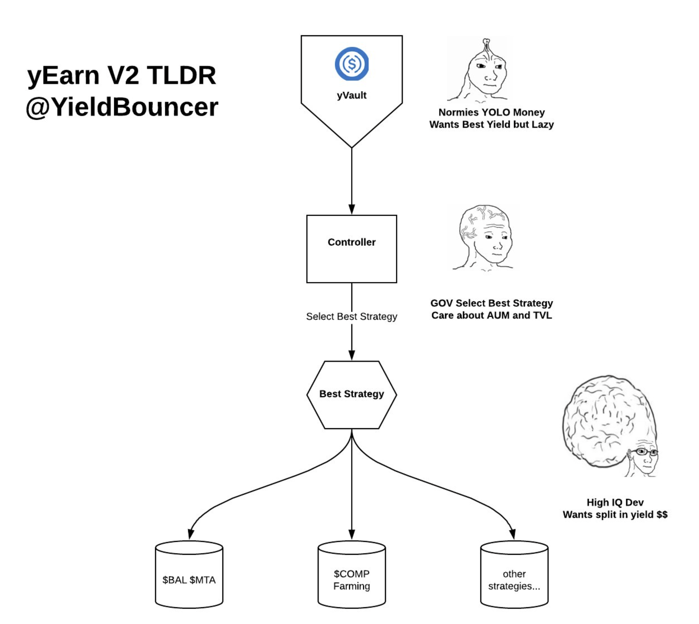
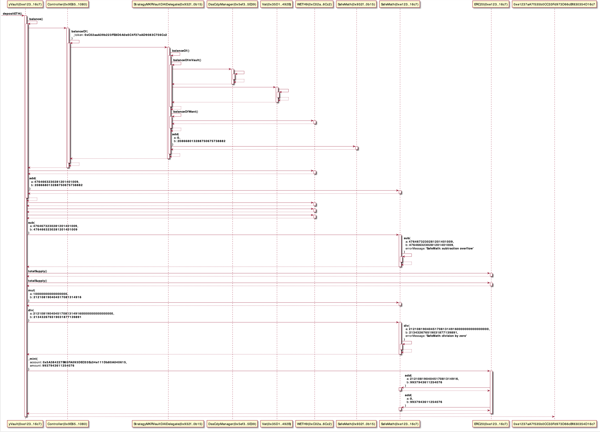
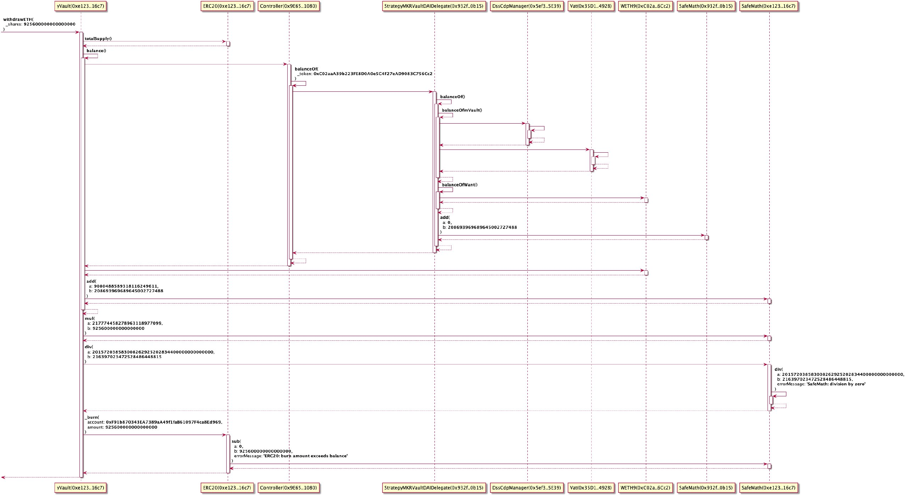

## Yeth

## Overall strcture of yVault

- [yETH vault explained](https://medium.com/iearn/yeth-vault-explained-c29d6b93a371)

## UML digrams

- [Controller.sol.svg](./Controller.sol.svg)
- [StrategyMKRVaultDAIDelegate.sol.svg](./StrategyMKRVaultDAIDelegate.sol.svg)
- [yVault.sol.svg](yVault.sol.svg)

## Flows

### 

- https://etherscan.io/tx/0x2f79adefdc14ab49dc5827dc1f2ef36cf5db6bc689633efe34b7f99b9f1dbda3

### Withdraw all

- https://defiexplore.com/tx/0x08dd85db1204ccc2af46d339f867856d6178e1b8f379396bc12dd78e6a9f9cdd
- https://etherscan.io/tx/0x08dd85db1204ccc2af46d339f867856d6178e1b8f379396bc12dd78e6a9f9cdd

### Harvest

- https://defiexplore.com/tx/0x092cd8617bed6d25fa13e07bfa8ee321e023b6c1b2dfa81f0d38059a8ab10466
- https://etherscan.io/tx/0x092cd8617bed6d25fa13e07bfa8ee321e023b6c1b2dfa81f0d38059a8ab10466

TBA

### ForceRebalance

- https://defiexplore.com/tx/0xa0cf6aa133918c338a9d4d15eb3f03180183d70c3ce5e34adf4699f191fe0144
- https://etherscan.io/tx/0xa0cf6aa133918c338a9d4d15eb3f03180183d70c3ce5e34adf4699f191fe0144

TBA

## Open Questions.

- How does it autmatically rebalance when Eth price changes?
- Currently [$17M USD](https://defiexplore.com/cdp/13972) worth of DAI are minted while there are only [$13M USD](https://www.curve.fi/iearn/) worth of DAI in Curve. What happens when it tries to rebalance when Eth price crashes and there isn't enough DAI in Curve?